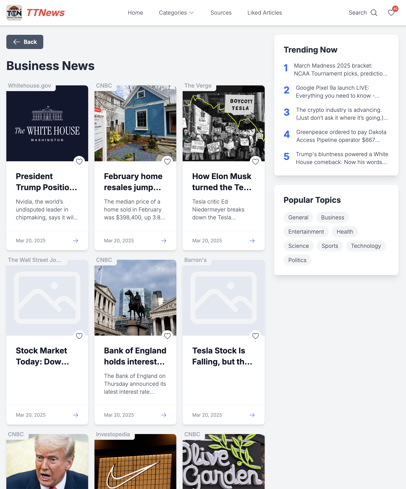
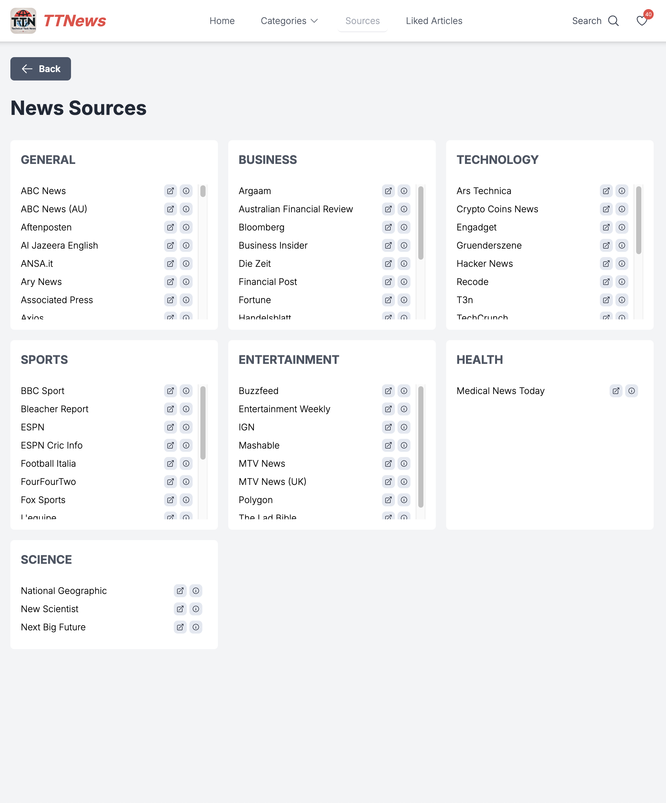
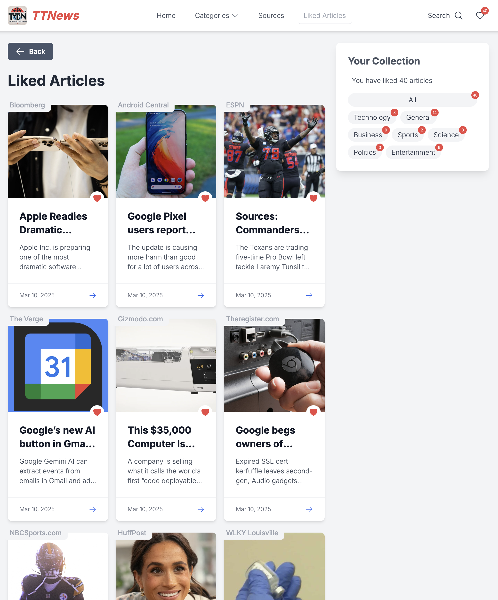
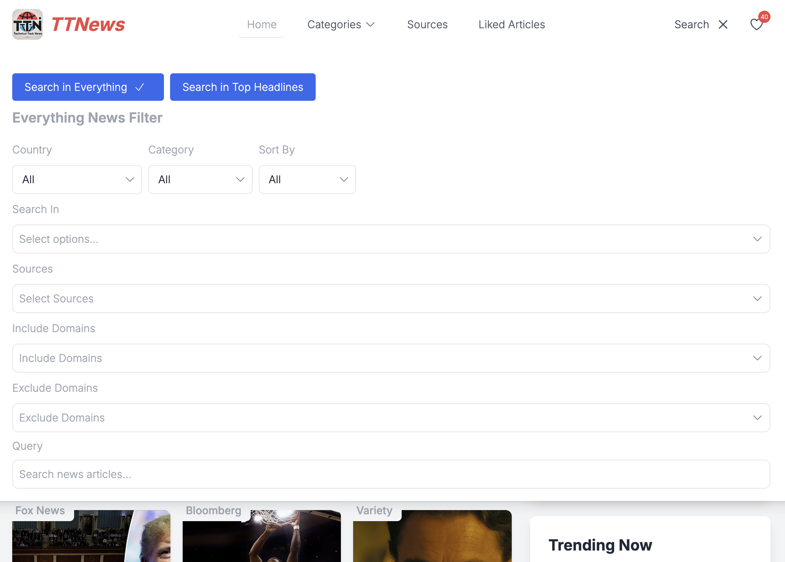
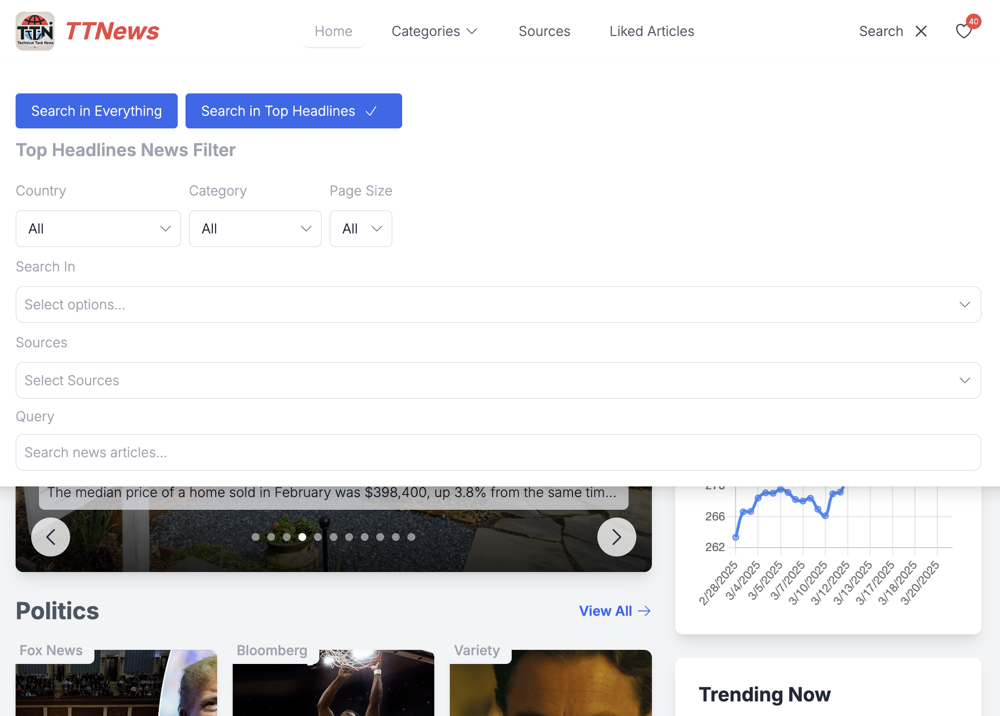
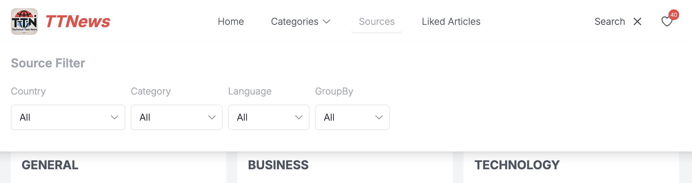
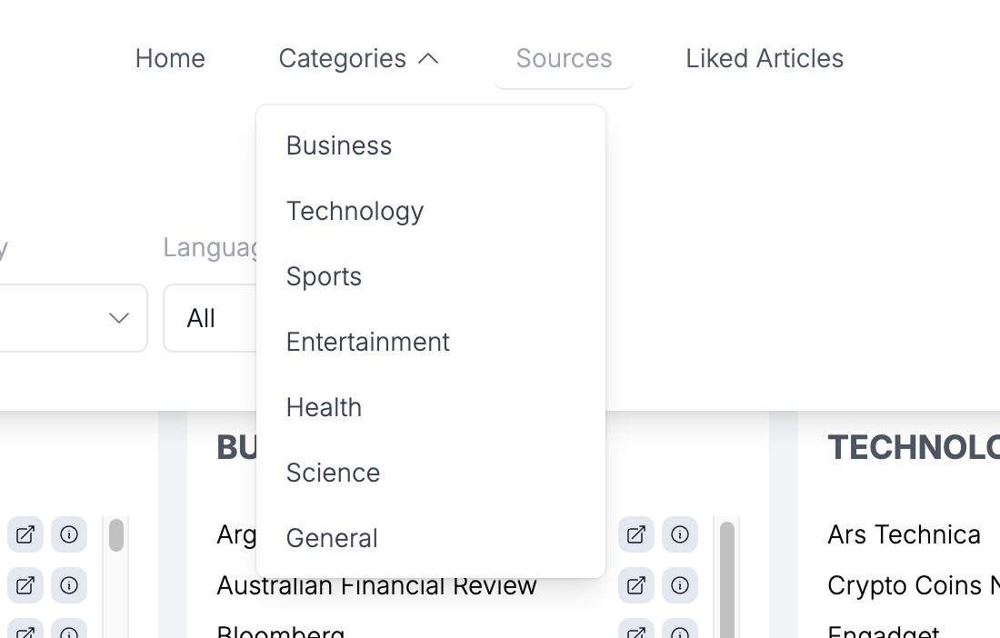

# News & Finance Dashboard

## Overview

This project is a **Vue 3 + TypeScript + Tailwind** application that provides a **news and financial dashboard**. It integrates with external APIs to fetch **latest news articles** and **financial market data**. The app features **multi-category news browsing, financial charts, search filters**, and a **responsive UI**.


## Features

- **News API Integration**: Fetch top headlines, articles, and sources.
- **Financial Data Integration**: Get stock quotes, time series, and market status.
- **Pinia State Management**: Centralized state handling for news, finance, and UI state.
- **Composable Functions**: Reusable logic for API calls and search filtering.
- **Dynamic UI Components**: Modular Vue components for search, filtering, and navigation.
- **Optimized Performance**: Cached API responses and debounced search queries.
- **Responsive Design**: Works on desktop and mobile.


## Main Pages ( Home - Categories - Sources - Liked Articles )








## Features and Nav Menu








---

## Project Structure

```
src/
│── api/                # API services & configurations
│   ├── config/         # API configuration files
│   ├── services/       # API service classes
│
│── assets/             # Static assets (images, icons, etc.)
│
│── components/         # Reusable Vue components
│   ├── form-elements/  # UI form elements (select, input)
│   ├── navigation/     # Navbar, menus, and logo
│   ├── search/         # Search-related components
│   ├── sections/       # News & financial sections
│   ├── widgets/        # Custom UI widgets (charts, finance data)
│
│── composables/        # Vue composables (API calls & utilities)
│   ├── useNews.ts      # Fetch news articles
│   ├── useFinance.ts   # Fetch finance data
│   ├── useSearch.ts    # Search & filter logic
│
│── constants/          # Constant values used across the app
│   ├── conNews.ts      # News-related constants
│   ├── conFinance.ts   # Finance-related constants
│   ├── conFilter.ts    # Search filter options
│   ├── conCountryCodes.ts # Mapping of country codes
│
│── layouts/            # Global layout components
│
│── mocks/              # Mock API responses (for testing)
│
│── router/             # Vue Router configuration
│
│── stores/             # Pinia stores for state management
│   ├── newsStore.ts    # Manages news data
│   ├── financeStore.ts # Manages financial data
│   ├── categoryStore.ts # Manages selected categories
│   ├── newsFilterStore.ts # Manages search filters
│   ├── newsSourceStore.ts # Manages news sources
│   ├── navigationStore.ts # Handles app navigation
│   ├── likedNewsStore.ts # Stores liked articles
│   ├── apiCacheStore.ts # Caches API responses
│   ├── errorStore.ts   # Handles global error state
│
│── styles/             # Global styles & Tailwind configurations
│
│── types/              # TypeScript types for API responses
│   ├── news.types.ts   # News API types
│   ├── finance.types.ts # Finance API types
│   ├── navigation.types.ts # Navigation-related types
│   ├── stores.types.ts # Store-related types
│   ├── utils.types.ts  # Utility function types
│
│── utils/              # Utility functions
│   ├── date.ts         # Date format helpers
│   ├── debounce.ts     # Debounce functions
│   ├── general.ts      # Miscellaneous utilities
│
│── views/              # Page-level Vue components
│   ├── HomeView.vue    # Homepage
│   ├── ArticleView.vue # News article details
│   ├── CategoryView.vue # News by category
│   ├── LikedNewsView.vue # Saved articles
│   ├── SourcesView.vue # News sources
│
│── App.vue             # Main app component
│── main.ts             # Vue app initialization
│── vite.config.ts      # Vite project configuration
│── README.md           # Project documentation
```

## Installation

To get started with the project, follow these steps:

1. **Clone the repository**:
    ```sh
    git clone https://github.com/yourusername/repo-name.git
    cd repo-name
    ```

2. **Install dependencies**:
    ```sh
    npm install
    ```

3. **Run the development server**:
    ```sh
    npm run dev
    ```

4. **Build for production**:
    ```sh
    npm run build
    ```

5. **Preview the production build**:
    ```sh
    npm run preview
    ```

## Maintenance

To maintain the project, consider the following:

- **Update dependencies** regularly to keep the project secure and up-to-date:
    ```sh
    npm update
    ```

- **Lint and format code** to ensure code quality:
    ```sh
    npm run lint
    npm run lint:check
    ```

## Security Issues

If you discover any security issues, please report them immediately. Follow these steps:

1. **Do not disclose security issues publicly** until they have been addressed.
2. **Contact the maintainers** directly via email or a private communication channel.
3. **Provide detailed information** about the issue, including steps to reproduce and potential impact.

---

For more information, refer to the official documentation and guidelines provided in the repository.